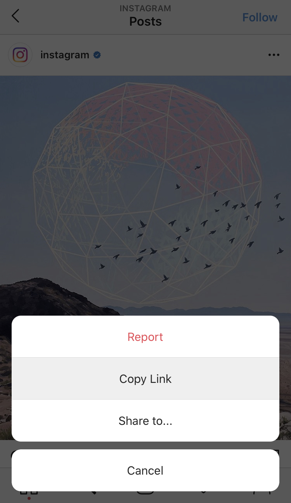
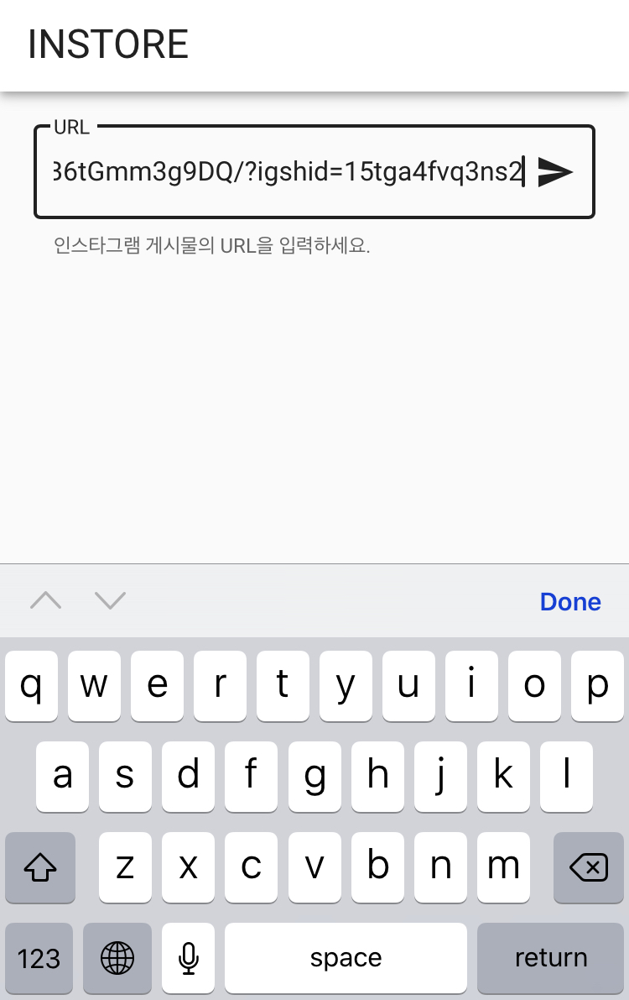
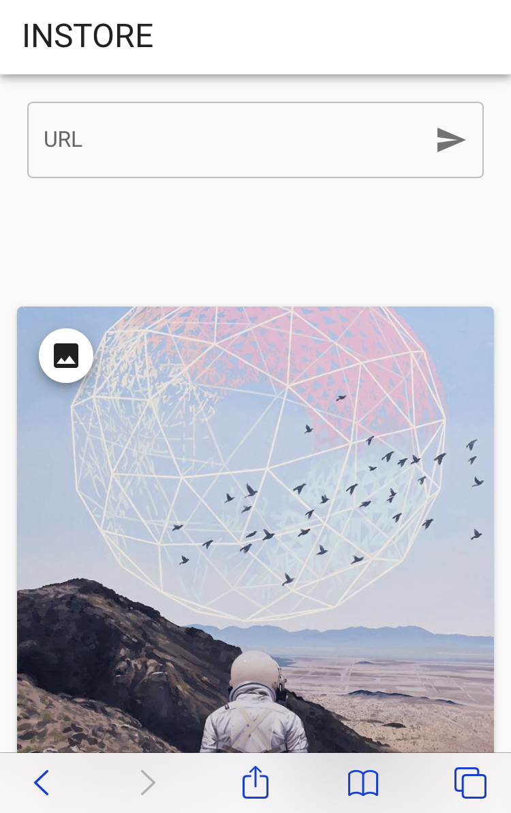
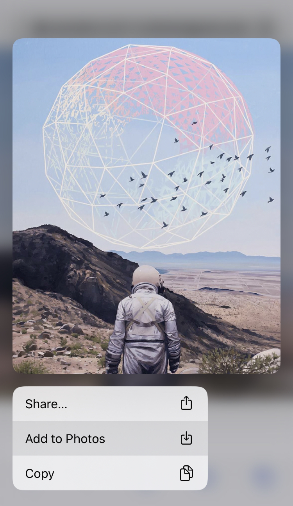

# INSTORE
Save the pictures on Instagram!

## Instruction


1. Copy link of posts.

2. Paste to input box and press enter key or send button.

3. Click an image what you want to save.

4. It will open with a new tab. Then save the image.


## Installation
Clone the repository.
```
$ git clone https://github.com/voiciphil/instore.git
```
Build frontend files.
```
$ cd instore/frontend
$ npm install
$ npm run build
```
Start the server.
```
$ cd ../backend
$ npm install
$ npm start
```
Now the website is running on `localhost:3000`.
